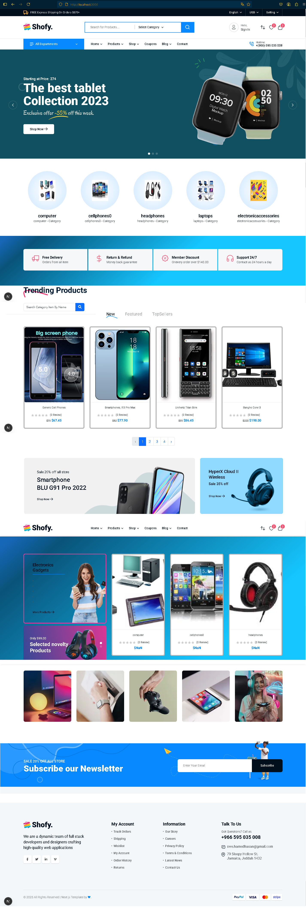
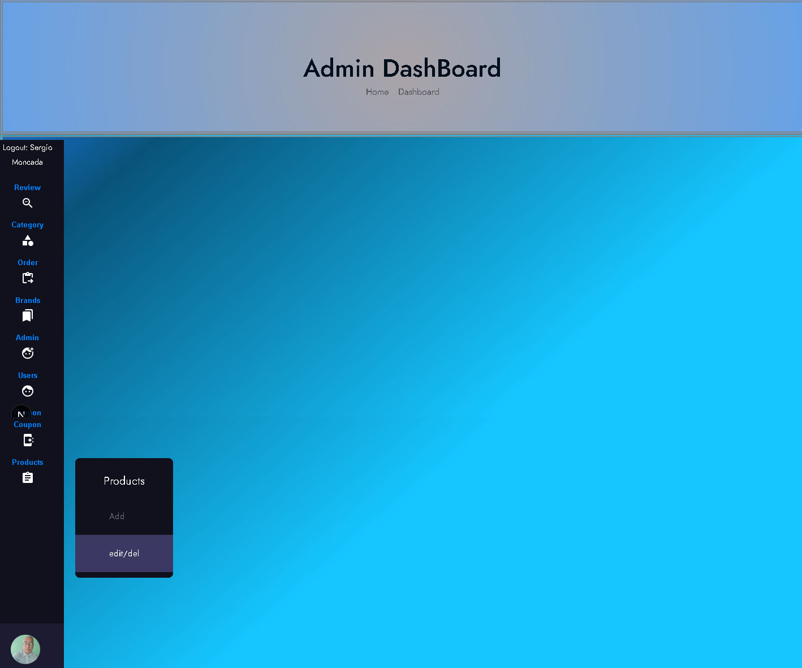
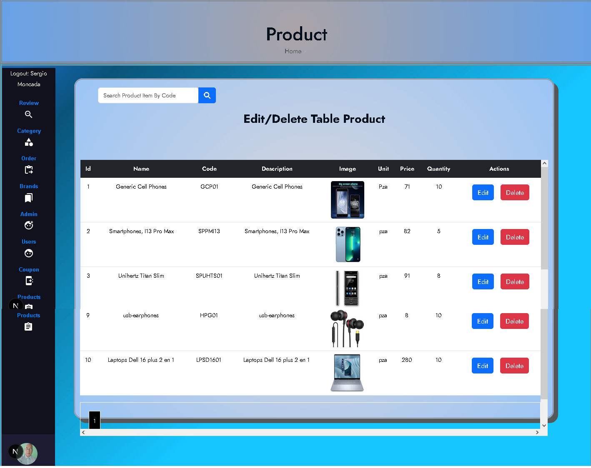
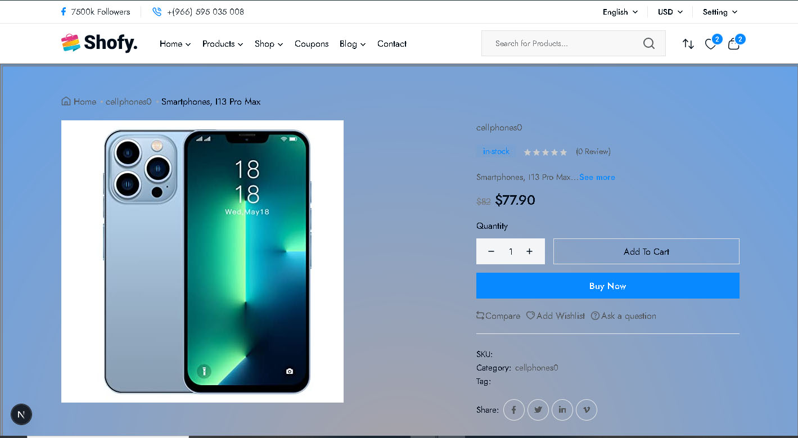
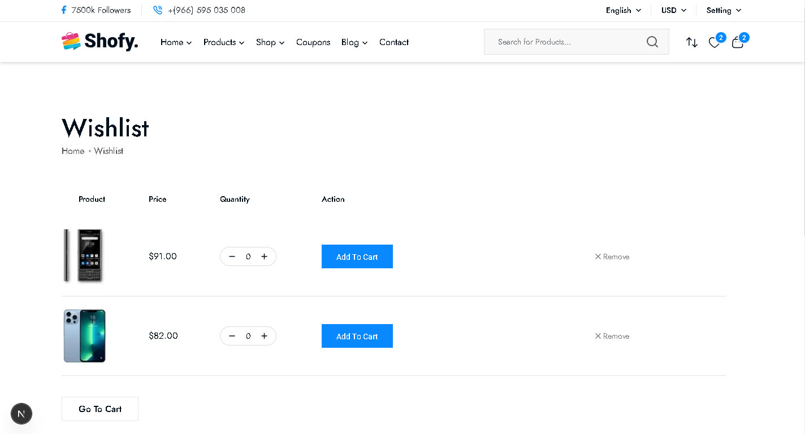
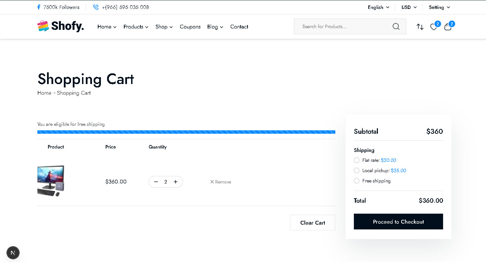

<h1 align ="center" > 🧑🏻‍💻 📺 🛒 EcommerElectronic NEXTJS 15.3.2  </h1>
<h5  align ="center"> 
Fullstack open source Ecommerce application made with MongoDB, Express, React , NEXTJS & Nodejs (MERN) </h5>
<br>
<br>

  * [Configuration and Setup](#configuration-and-setup)
  * [Key Features](#key-features)
  * [Technologies used](#technologies-used)
      - [Frontend](#frontend)
      - [Backend](#backend)
      - [Database](#database)
      - [API](#api)
  * [📸 Screenshots](#screenshots)
  * [Author](#author)
  * <br>
  * ## Configuration and Setup

In order to run this project locally, simply fork and clone the repository or download as zip and unzip on your machine.

- Open the project in your prefered code editor.
- Go to terminal -> New terminal (If you are using VS code)
- Split your terminal into two (run the client on one terminal and the server on the other terminal)

In the first terminal

```
$ cd client
$ npm install (to install client-side dependencies)
$ npm run  start (to start the client)
```
```
ADD AN USER TO THE SYSTEM IN SIGNUP PAGE, AND THEN IN MONGODB CHANGE STATUS TO Admin, to get into the ADMIN AREA
WHEN YOU CHANGE THE STATUS WILL APPEAR THE OPTION GO TO ADMIN AREA IN MIDDLE MENU AT DASHBOARD/HOME PAGE
```
```
#  --- .env  ---
NEXT_PUBLIC_BACKEND_BASE_URL="http://localhost:7000/"
```
In the second terminal

- cd server and Set environment variables in .env
- Create your mongoDB connection url, which you'll use as your MONGO_URL
- Supply the following credentials
- nodemon index -- to run backend server


```
#  --- .env  ---

PORT=7000
NODE_ENV=development
# your mongo database url
TOKEN_SECRET=fbb2d60078ba3907a2eba275d2aeee5c6dd064c183b8a07013b56044c2156fbb1d0da15f2817a5f06bcc27a4c1b36027a2555b3997b4182f6d5a4c008be95d13
JWT_SECRET_FOR_VERIFY=724b07ce96f552b2d9405fb02899e199d14fdb874cf33634a3d233a649b8544a0a6ec9874c9d2f705bc983b478686d0808924b4fcd3166c752d492101c5c419d
SERVICE=gmail
EMAIL_USER=sergiogmoncada@yahoo.com #your sender email
EMAIL_PASS=   #you email app password
HOST=smtp.ethereal.email
EMAIL_PORT=465
STRIPE_KEY=
   #your stripe secret api key
STORE_URL=http://localhost:3000
ADMIN_URL=http://localhost:4000
IMAGE_URL='http://localhost:7000/images/' /**DONT FORGET TO CREATE THE SUBDIRECTORY PUBLIC/IMAGES
```

```
# --- Terminal ---

$ npm install (to install server-side dependencies)
$ npm start (to start the server)
```


## ✔️ Tecnologias Utilizadas:


<br>
##  Screenshots:
<br>






<br>

##  Key Features:

- User registration and login
- Authentication using JWT Tokens
- ADMIN AREA, ONLY FOR CATEGORIES AND PRODUCTS :Add, edit, delete Products AND CATEGORIES
- IMAGES CONTROL WITH MULTER.
- Leave a Reviews
- Delete Reviews
- Password Update
- Live Search 
- 404 Page and many more
- Responsive Design
<br/>

##  Technologies used

This project was created using the following technologies.

####  Frontend 

- [React js - nextjs ](https://www.npmjs.com/package/react) - JavaScript library that is used for building user interfaces specifically for single-page applications
- [React Hooks  ](https://reactjs.org/docs/hooks-intro.html) - For managing and centralizing application state
- [react-router-dom](https://www.npmjs.com/package/react-router-dom) - To handle routing
- [axios](https://www.npmjs.com/package/axios) - For making Api calls
- [React-bootstrap](https://mui.com/) - For User Interface
- [React Redux](https://react-redux.js.org/) - manage application state efficiently and provide a more structured mechanism for managing data
- [React Toastify](https://www.npmjs.com/package/react-toastify) - To display interactive and responsive notifications (toasts) in web applications

####  Backend 

- [Node js](https://nodejs.org/en/) -A runtime environment to help build fast server applications using JS
- [Express js](https://www.npmjs.com/package/express) -The server for handling and routing HTTP requests
- [Mongoose](https://mongoosejs.com/) - For modeling and mapping MongoDB data to JavaScript
- [axios](https://www.npmjs.com/package/axios) - For making Api calls
- [jsonwebtoken](https://www.npmjs.com/package/jsonwebtoken) - For authentication
- [cookie-parser](https://www.npmjs.com/package/cookie-parser) - Middleware module used in Node.js web applications to manage cookies
- [cors](https://www.npmjs.com/package/cors) - Provides a Connect/Express middleware
- [Dotenv](https://www.npmjs.com/package/dotenv) - Zero Dependency module that loads environment variables
- [express-validator](https://www.npmjs.com/package/express-validator) - Used in Node.js applications with the Express framework to validate data submitted by users (user input)
- [nodemon](https://nodemon.io/) - Development utility for Node.js applications. Node.js is a runtime platform that allows you to run JavaScript on the server side.t
- [Multer] - Handle Images

####  Database 

 - [MongoDB ](https://www.mongodb.com/) - It provides a free cloud service to store MongoDB collections.

## Author
- Portfolio: https://sergio7174.github.io/MyPersonalPortFolio/
- Github:  
- Sponsor: 
- Linkedin:(https://www.linkedin.com/in/sergio-moncada-rivas-4ab877351)
- Email: [sergiogmoncada@yahoo.com](mailto:sergiogmoncada@yahoo.com)

